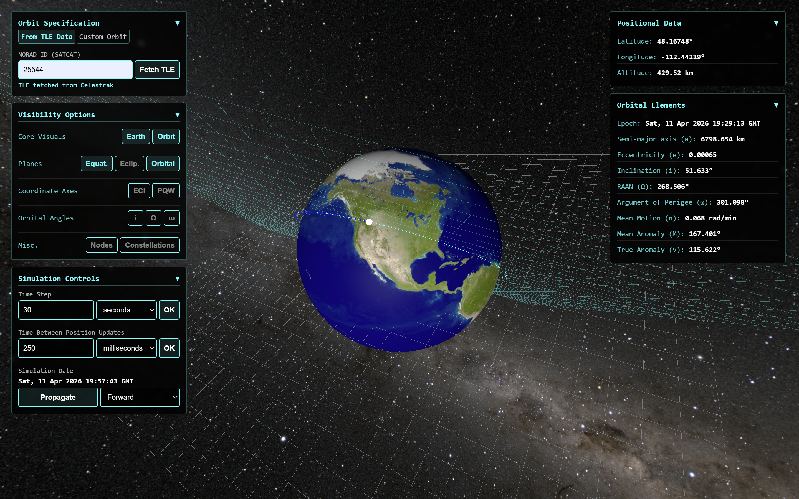

# Orbital Simulator

Visualize and simulate orbits in an interactive 3D web application. Work with real orbital data using TLEs fetched from Celestrak, or define custom orbits with Keplerian elements. Granular configurability and data visualization allows a better understanding of past, present, or future mission profiles.

### Live Demo: https://connorperrone.github.io/orbital-simulator/

---



---

## Features

- **Real satellite tracking**:
     - Provide a NORAD ID of a satellite to fetch TLE data from [Celestrak](https://celestrak.org/)
     - Propagate the orbit with SGP4 using the [satellite.js](https://github.com/shashwatak/satellite-js) package
     - Caching mechanism in line with Celestrak's recommendation of a 2 hour TTL 
- **Custom orbit definition**:
     - Define any orbit by its Keplerian orbital elements (semi-major axis, eccentricity, inclination, RAAN, argument of perigee, true anomaly)
     - Custom two-body propagation using the Newton-Raphson method to solve Kepler's equation (see [Methods](#methods))
- **Simulation controls**:
     - Live tracking feature (enabled by default) to synchronize simulation time with the system clock for live estimated orbital position
     - Configurable simulation time step and update rate with support for forward and reverse propagation
- **Visualization of orbital elements**:
     - Toggleable visualizations of the orbit trajectory and plane, equatorial plane, perifocal coordinate system axes ($\hat{P}$, $\hat{Q}$, $\hat{W}$), Earth-centered inertial frame axes ($\hat{X}$, $\hat{Y}$, $\hat{Z}$), inclination, RAAN, argument of perigee, and more
     - Live visual feedback of custom-defined orbital elements allows users to better understand and define orbits
- **Live data panels**:
     - Geodetic position (latitude, longitude, altitude) and Keplerian elements displayed with propagation

---

## Methods

### SGP4 Propagation (TLE Mode)

Uses the SGP4 model through [satellite.js](https://github.com/shashwatak/satellite-js) to propagate TLE-defined orbits. Updates orbital elements using the mean elements of the state vector 4 times per orbital period to smoothly visualize orbit drift without sacrificing performance.

True anomaly is calculated from the SGP4 state vector (where $\vec{r}$ and $\vec{v}$ are the position and velocity vectors respectively) using the eccentricity vector:

$$\vec{e} = \left(\frac{|v|^2}{\mu} - \frac{1}{|r|}\right)\vec{r} - \frac{(\vec{r} \cdot \vec{v})}{\mu}\,\vec{v}$$

$$\nu = \arccos\!\left(\frac{\vec{e} \cdot \vec{r}}{|\vec{e}|\,|\vec{r}|}\right), \quad \vec{r} \cdot \vec{v} < 0 \Rightarrow \nu \to 2\pi - \nu$$

### Kepler's Equation (Custom Orbit Mode)

Uses the Newton-Raphson method to numerically approximate a solution for the eccentric anomaly $E$ in Kepler's equation:

$$M = E - e\sin(E)$$

The Newton-Raphson form is then found as follows:

$$f(E) = E - e\sin(E) - M = 0$$
$$f'(E) = 1 - e\cos(E)$$
$$E_{i+1} = E_i - \frac{f(E_i)}{f'(E_i)}$$
$$E_{i+1} = E_i - \frac{E_i - e\sin(E_i) - M}{1 - e\cos(E_i)}$$

The algorithm initializes $E_0 = M$ and stops when $|E_{i+1} - E_i| < 0.001$ or when 10 iterations have passed. The numerically approximated solution is then used to calculate the true anomaly:

$$\nu = 2\arctan\!\left(\sqrt{\frac{1+e}{1-e}}\tan\frac{E}{2}\right), \quad \nu < 0 \Rightarrow \nu \mathrel{+}= 2\pi$$

and the $(x, y)$ position in the orbital plane (PQW):

$$x = a(\cos(E) - e)$$
$$y = a(\sqrt{1 - e^2})\sin(E)$$

This places the satellite accurately within its orbital frame, which is rotated and scaled to be rendered in Three.js' coordinate system.

---

## Project Structure

```
src/
├── main.js               # UI, simulation state, main loop
├── orbital-mechanics.js  # Custom orbit propagation, mean and true anomaly calculations
├── scene.js              # Three.js scene, meshes, coordinate frames
└── tle.js                # Celestrak fetch and caching methods
```

---

## Run the Project Locally

```bash
npm install
npm run dev
```